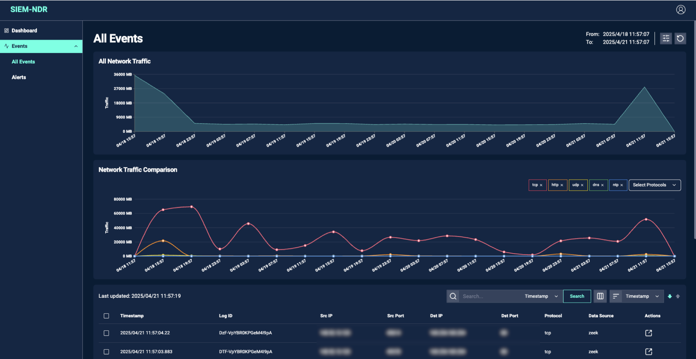
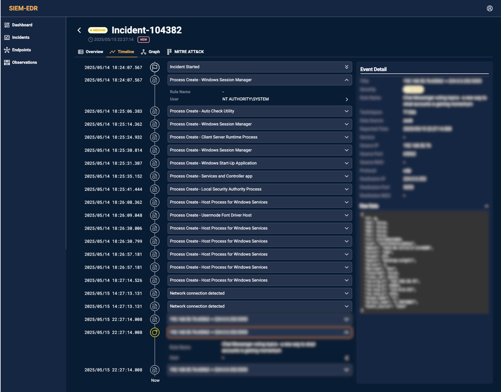
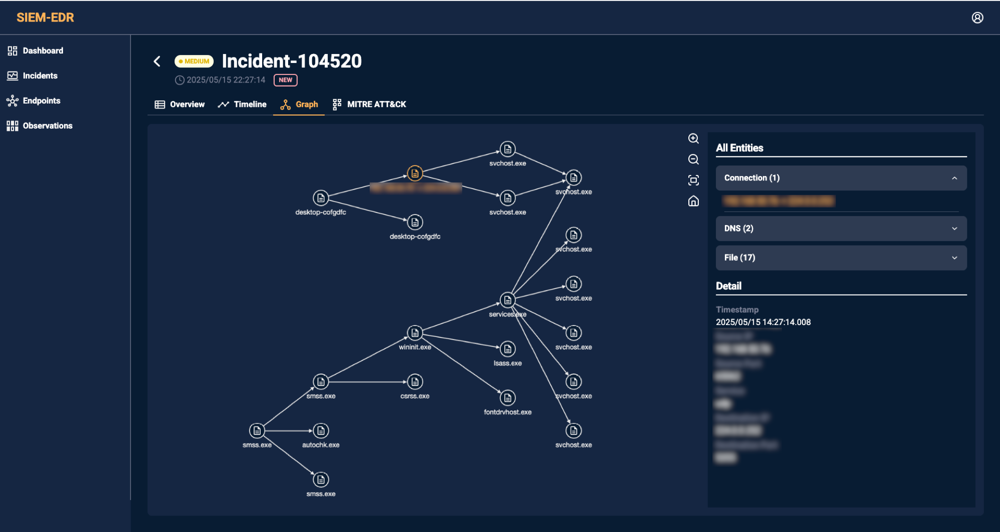
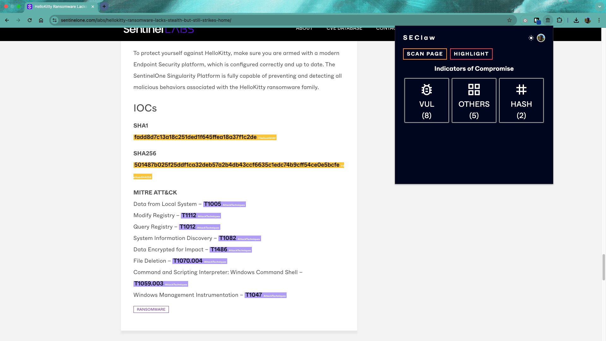
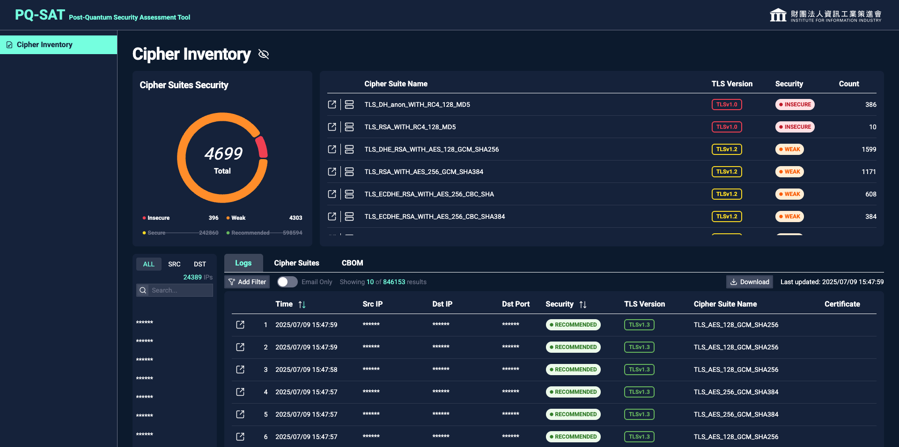

# Portfolio

### Network Detection and Response (NDR) - 資策會資安所

用於監控與分析網路流量的系統，能即時偵測可疑行為與潛在威脅，並支援異常流量偵測、威脅視覺化與自動化回應，強化網路資安的防禦與可視性。

- **成果**
  - 技術轉移至台灣大哥大
  - [iThome - 資策會與台灣大哥大聯手啟動新世代SOC，為中小企業帶來資安及時雨](https://ithome.com.tw/pr/166374)

- **負責項目**
  - 主導前端開發 (Next.js) 及參與 UI 設計 (Figma)
  - 撰寫及調整部分後端 API (FastAPI, OpenSearch Query DSL)

### Endpoint Detection and Response (EDR) - 資策會資安所

用於監控端點裝置行為的系統，能即時偵測潛在威脅如惡意程式、異常行為等，並支援事件記錄、日誌調查分析與自動化回應，強化對端點攻擊的防禦與應變能力。

- **負責項目**
  - 主導前端開發 (Next.js) 及 UI 設計 (Figma)

### SEClaw - 資策會資安所

使用 Chrome 擴充功能結合 IoC 萃取模型，分析當前網頁中的威脅情資報告，將萃取出的威脅指標自動分類並標註於頁面上，以提升情資資料庫的完整性與可用性。

- **負責項目**
  - 主導前端開發 (HTML, Chrome Extension) 及 UI 設計 (Figma)

### Post-Quantum Security Assessment Tool (PQ-SAT) - 資策會資安所

識別網路通訊所採用的加密機制，分析其安全性並進行評等，呈現加密封包與憑證資訊，強化通訊安全的可視性。

- **成果**
  - 與多家廠商進行 POC
  - [iThome - 資策會導讀臺灣最新出爐的PQC遷移指引，預告兩週後將推出自動化加密盤點工具](https://www.ithome.com.tw/news/168489)

- **負責項目**
  - 主導前、後端開發 (Next.js, Prisma)

